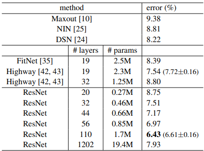

## resnet：Deep Residual Learning for Image Recognition

#### 标题（Title）

 resnet：用于图像识别的深度残差学习

#### 摘要（Abstract)

大概讲了深层的网络较难训练，但加入了残差连接后能较轻松地训练更深的网络，且获得更高的精度，这个模型赢得了ImageNet和COCO比赛的冠军。

#### 引言（Introduction）

深层的网络由于链式法则会出现梯度爆炸或梯度消失，使用归一化、正则化能让模型收敛。但随着网络深度的增加，深层的网络效果反而不如浅层网络。

由图可知，训练和测试精度都变差了，所以不是过拟合。

考虑一个浅层的网络以及加入了若干层后变成的一个深层的网络，理论上深层的网络不应该比浅层的差，因为加入的层可以学成“identity mapping”,即对输入的数据不造成影响，原样输出，这样深层与浅层就一样了，但实际训练过程中是做不到的，所以要改造网络。过程：假设一个层的输入为x，原本的网络要学习的函数是$H(x)$，现在变为$F(x):=H(x)-x$，最后在输出后加上一个$x$，即$F(x)+x$，如图所示

这种residual connection结构是文章的核心思想，它比一般的网络结构更利于优化收敛。

#### 相关工作（Related work）

介绍了前人做过的类似的有关残差和短路连接的工作。

#### 深度残差学习（Deep Residual Learning）

##### 1.残差学习

加入残差相当于把网络初始化为恒等映射，模型在恒等映射附近寻找最优解比学习一个新的函数要容易的多

由图可知，resnet比普通网络响应小，用恒等映射是一种更好的预处理方式。

##### 2.通过短路连接进行恒等映射

如果输入与输出维度相同，则元素逐项相加；若维度不同，则用0补齐或者用1x1卷积核升维

##### 3. 网络架构

resnet前两层是一样的，都是7x7卷积和3x3池化，后面接若干残差块和一个全连接层。resnet-18,resnet-34类似块内卷积都用3x3卷积核，通道数逐渐变大64，128，256，512。深层的resnet块内略有不同，因为通道数x4，计算复杂度x16，性价比低，所以先用1x1投影回64,再3x3,最后用1x1投影回256，共三层,这个叫做深度瓶颈结构。参考VGG设计plain网络，resnet34的计算复杂度为plain的18%。

##### 4.实现

1. 图像分别随机被压缩到256到480之间，并做图像增强

2. 对图像或它的水平镜像随机裁剪10张224x224的小图

3. 在每一个卷积层之后，激活层之前均使用batch normalization

参数： mini-batch为256，学习率为0.1，训练60万的迭代次数，正则化0.0001，动量是0.9，没有使用dropout。

#### 实验（Experiments）

1.对18，34层的plain网络进行训练，出现退化

2.对18，34层的resnet进行训练,有三个发现：1.resnet能很好解决退化问题2.resnet-34效果更好说明深层的网络是可以用残差训练的3.resnet收敛速度更快

3.A-填0，B-不同是投影，C-全部投影，C效果最好但性价比不高，所以选B

#### CIFAR-10 和分析

主要讲了在CIFAR-10数据集上的效果

若层数加到1000层，会有overfitting，但不明显

层数过深时，后面的层基本为0，没什么作用

#### resnet梯度保持较好的原因

$$
\frac{\partial{L(H(g(x,w)))}}{\partial{w}}=\frac{\partial{L(H(g(x,w)))}}{\partial{H(g(x,w))}}\frac{\partial{H(g(x,w))}}{\partial{g(x,w)}}\frac{\partial{g(x,w)}}{\partial{w}}
$$

原来的网络梯度会因为链式法则越乘越小，

$$
\frac{\partial{L(H(g(x,w)))}}{\partial{w}}=\frac{\partial{L(F(g(x,w))+g(x,w))}}{\partial{w}}\\=\frac{\partial{L(F(g(x,w)))}}{\partial{F(g(x,w))}}\frac{\partial{F(g(x,w))}}{\partial{g(x,w)}}\frac{\partial{g(x,w)}}{\partial{w}}+\frac{\partial{L(g(x,w))}}{\partial{g(x,w)}}\frac{\partial{g(x,w)}}{\partial{w}}
$$

resnet梯度有了后半部分保持的较好。

