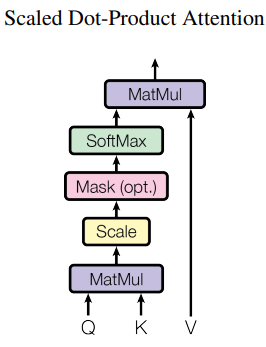
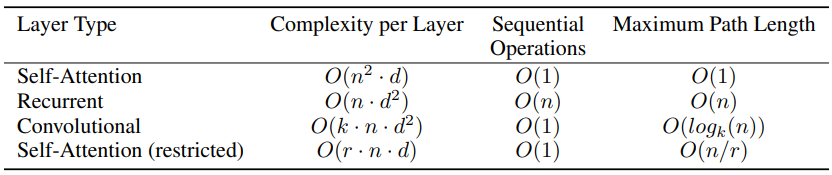

### Attention Is All You Need

#### 标题（Title）

注意力是你的所有需求

#### 摘要（Abstract）

在机器翻译任务上，提出了一个不同于以往RNN,CNN的一个新的简单的模型，即只基于单独的attention机制。这个模型在机器翻译上取得了良好的效果。

#### 引言（Introduction）

以往的模型具有时序性，得到$h_t$的结果需要使用当前输入和$h_{t-1}$的结果，这导致网络的并行性很差，尽管有各种方法增加计算效率但治标不治本。注意力机制在以往是与递归模型一起使用的，而transformer只基于单独的attention机制，并行性要好得多。

#### 背景（Background）

以往的模型若要关联位置较远的输入需要更多的操作数，transformer则可以更方便地看到全局的依赖关系，一些负面影响也可以用多头注意力机制消除。

自注意机制能将一个序列的不同位置联系起来，端到端的记忆网络使用循环attention机制替代序列对齐的循环，这是前人的工作，且已被证明有良好的效果。transformer则是第一个完全依赖自注意机制的模型。

#### 模型结构（Model Architecture）

以往模型的编码器与解码器：编码器将一个句子的每个词变为向量，将向量组合变为$\mathbf{z}=(z_1,\cdots,z_n)$输入解码器，解码器逐个输出，每次输入都把上一次输出作为输入。transformer参考了这一设计，它训练时采用并行，翻译时则逐个输出。训练时inputs输入要翻译的句子，outputs输入对应翻好的句子，softmax后计算损失函数，并做反向传播；翻译时inputs输入要翻译的句子，outputs输入\<BOS>表示beginning of sequence，由softmax得到输出，将输出放到outputs得到下一个输出，直到最后。

inputs和outputs会先进行词嵌入，变为向量，再做位置编码后输入。

$$
P E(pos,2i) = sin(\frac{pos}{10000^\frac{2i}{d_{model}}})\\
P E(pos,2i+1) = cos(\frac{pos}{10000^\frac{2i}{d_{model}}})

$$

位置编码可以学习得来或用sin,cos函数固定编码，固定编码公式如上，位置为pos的词词嵌入后变为$d_{model}$维的向量，按奇数偶数维带入公式便可得到$d_{model}$维的位置编码，加入原来的向量即可。

编码器中的Q,K,V是同一个东西，输入解码器中的Multihead Attention，作为K,V；解码器也有一个输入，经过类似的操作后，作为Q输入解码器中的Multihead Attention，比较V与Q的相似度，高的权重大。

$$
Attention(Q,K,V) = softmax(\frac{QK^T}{\sqrt{d_k}})V
$$

Attention图示与公式如上，其中A矩阵左上表示第一个词与自己的关系，右上表示第一个词与第二个词的关系，左下表示第二个词与第一个词的关系，右下表示第二个词与自己的关系。对$Q_t$来说，只要与$K_1,\cdots,K_t$相乘，所以用掩码将后面的K遮住，方法是把后面的变的极小，如-1e10，softmax时概率就会变为0。

$$
MultiHead(Q,K,V)=Concat(head_1,\cdots,head_h)W^O\\
head_i=Attention(QW^Q_iKW^K_iVW^V_i)
$$

多头注意力机制：每个“头”的操作是把V,K,Q输入线性层，再做Attention，最后把所有输出合并。

为何选择self-attention?

由图可以看到自注意力的复杂度要小于循环，卷积，受限的自注意力

#### 训练、结果、结论（Train,Result,Conclusion）

transformer比以往的模型训练时间短，训练效果好，且拥有应用在图片，音频，视频上的可能性。
