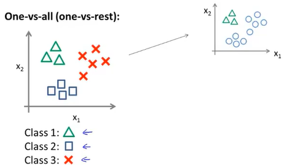
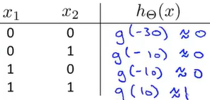

# 机器学习笔记

## 吴恩达教程

### 1.监督学习

learns from being given "right answers"

训练一个函数（或模型），该函数能够将输入(input:x)映射到预测的输出(output:y)，以最小化预测误差。

训练集同时带有输入x和输出标签y

Regression(回归):一种特殊类型的监督学习，从无数种数据中预测一种可能数据


classification(分类):另一种类型的监督学习，预测类别，比如：良性（恶性），0（1），猫（狗）


输入(input:x)可以是多个，比如（肿瘤尺寸、年龄、细胞均匀程度）

### 2.非监督学习

非监督学习的目标通常是从数据本身中发现模式、结构或者特征，而不是预测标签或目标变量。

训练集只有输入x

Clustering(聚类):将数据集中的样本分成不同的组，每个组内的样本尽可能相似，而不同组之间尽可能不同。


Anomaly detection(异常检测):

Dimensionality reduction(降维):减少数据的维度，保留最重要的特征信息，以便可视化或者简化后续的计算。

### 3.线性回归

f<sub>w,b</sub>(x) = wx+b

 使$J_{(w,b)} = \frac{1}{2n}\sum_{i=1}^{n}(f(x_i)-y_i)^2$最小


不断迭代$(w,b) = (w,b) + a(-\frac{\partial J}{\partial w},-\frac{\partial J}{\partial b})$其中a为学习率

计算偏导：$\frac{\partial J}{\partial w} = \frac{1}{n}\sum_{i=1}^n(f(x_i)-y_i)x_i$, $\frac{\partial J}{\partial w} = \frac{1}{n}\sum_{i=1}^n(f(x_i)-y_i)$.

代码实现：

```python
def predict(x, w, b):
    return w * x + b


# 实现mse损失函数代码
def mse(y_true, y_pred):
    cost = 0
    for i in range(len(y_true)):
        cost += (y_pred[i] - y_true[i]) ** 2
    cost /= 2 * len(y_true)
    return cost


# 实现对于梯度的手动计算
def compute_gradients(x, y, y_pred):
    w = 0
    b = 0
    for i in range(len(x)):
        w += (y_pred[i] - y[i]) * x[i]
        b += y_pred[i] - y[i]
    w /= len(x)
    b /= len(x)
    return w, b


# 实现梯度下降函数
def gradient_descent(x, y, learning_rate, epochs):
    w = 0
    b = 0
    for i in range(epochs):
        w_grad, b_grad = compute_gradients(x, y, predict(x, w, b))
        w -= learning_rate * w_grad
        b -= learning_rate * b_grad
    return w, b
```

### 4.多元线性回归

预测式：$f(x_1,x_2,\cdots,x_n) = \theta_0+\theta_1x_1+\theta_2x_2+\cdots+\theta_nx_n$, 改写为$f(x) = \theta_0x_0+\theta_1x_1+\theta_2x_2+\cdots+\theta_nx_n$($x_0 = 1$), 矩阵表示为

$$
\left[\begin{matrix}
\theta_0 & \theta_1 & \cdots & \theta_n
\end{matrix}\right]
\cdot
\left[\begin{matrix}
x_0 \\
x_1 \\
\vdots \\
x_n
\end{matrix}\right]
= \theta_0x_0+\theta_1x_1+\theta_2x_2+\cdots+\theta_nx_n

$$

代价函数：$J_{(\theta_0,\theta_1,\cdots,\theta_n)} = \frac{1}{2m}\sum_{i=1}^{m}(f_\theta(x_i)-y_i)^2$

迭代：$\theta_k = \theta_k - a\frac{\partial J(\theta)}{\partial \theta_k}$, 化简得$\theta_k = \theta_k - a\frac{1}{m}\sum_{i=1}^m(f_\theta(x_i)-y_i)x_{ki}$

提高算法效率：

1.特征缩放

前提：每一类数据数值相近

房价price：1000~2000，卧室数num：1~5

$\frac{price}{2000}$,$\frac{num}{5}$缩放后等值线接近圆，梯度下降更快


2.学习率a

a过大导致冲过最小值点，代价函数增大

a过小导致收敛缓慢

### 5.多项式回归


用$x_1,x_2,x_3$代替多项式后使用线性回归，特征缩放会变得格外重要

### 6.分类(logistic regression)

logistic function:$f(x) = \frac{1}{1 + e^{-x}}$,x趋向于正无穷，$f(x)$趋向于1，x趋向于负无穷，$f(x)$趋向于0，$x = 0,f(x) = 0.5$

$f(\theta^Tx)$，解释：给出矩阵$\left[\begin{matrix} x_0\\x_1\\\vdots\\x_n \end{matrix}\right]$得到值为P，P为$y = 1$的概率，$\theta^Tx = 0$为决策边界。


计算$\theta$：原先的代价函数会产生多个局部最优解

新的代价函数，合并得

$$
cost(h_\theta(x),y) = -ylog(h_\theta(x))-(1-y)log(1-h_\theta(x))
$$

所以

$$
J(\theta) = -\frac{1}{m}\sum_{i=1}^m[y_ilog(h_\theta(x_i))+(1-y_i)log(1-h_\theta(x_i))]
$$

$$
\frac{\partial J(\theta)}{\partial \theta_j} = \frac{1}{m}\sum_{i=1}^m(h_\theta(x_i)-y_i)x_j
$$

$$
\theta_j = \theta_j - \alpha\frac{1}{m}\sum_{i=1}^m(h_\theta(x_i)-y_i)x_{ji}
$$

由$J(\theta)$最小得$\theta$,再由$h_\theta(x)$计算预测值

### 7.多元分类



一对多，转化为二元问题

### 8.过拟合


过度拟合导致无法很好地运用到新数据中

解决方法：

1、减少特征值（人工，模型选择算法）

2、正则化

### 9.正则化

1.线性回归正则化

$J_{(\theta_0,\theta_1,\cdots,\theta_n)} = \frac{1}{2m}[\sum_{i=1}^{m}(f_\theta(x_i)-y_i)^2+\lambda\sum_{j=1}^{n}\theta_j^2]$

加入惩罚项$\lambda\sum_{j=1}^{n}\theta_j^2$使$\theta_j$减少，相关性低的项$\theta_j\approx0$，避免过拟合

$\theta_k = \theta_k(1-\alpha\frac{\lambda}{m})-\alpha\frac{1}{m}\sum_{i=1}^m(f_\theta(x_i)-y_i)x_{ki}$

2.logisitc正则化

$\theta_j = \theta_j(1-\alpha\frac{\lambda}{m})-\alpha\frac{1}{m}\sum_{i=1}^m(h_\theta(x_i)-y_i)x_{ji}$

### 10.神经网络

#### 简单例子：

AND:

NOT:

OR:

XNOR:

#### 代价函数与最小值

分类代价函数：

$$
J(\theta) = -\frac{1}{m}\sum_{i=1}^m[y_ilog(h_\theta(x_i))+(1-y_i)log(1-h_\theta(x_i))]+\frac{\lambda}{2m}\sum_{j=1}^n\theta_j^2
$$

神经网络形式：

$$
J(\theta) = -\frac{1}{m}\sum_{i=1}^m\sum_{k=1}^{s_L}[y_i^{(k)}log(h_\theta(x_i))_k+(1-y_i^{(k)})log(1-(h_\theta(x_i))_k)]+\frac{\lambda}{2m}\sum_{l=1}^L\sum_{i=1}^{s_l}\sum_{j=1}^{s_{l+1}}(\theta_{ji}^{(l)})^2
$$

$(h_\theta(x_i))_k$表示第k个输出，三个求和指所有输入的系数。

##### 前向传播：


过程：

1. **输入数据传递**: 将输入数据传递给神经网络的输入层。

2. **加权求和**: 在每一层中，输入数据与对应的权重进行加权求和，然后加上偏置项（bias）做为神经元的净输入。

3. **激活函数处理**: 将每个神经元的净输入通过激活函数 （如$\frac{1}{1+e^{-x}}$） 进行非线性变换，得到神经元的输出。

4. **传递至下一层**: 将每个神经元的输出作为下一层神经元的输入，重复执行加权求和和激活函数处理的步骤，直到到达输出层为止。

5. **输出层输出**: 最后一层的输出即为整个神经网络的输出结果，用于进行后续的预测或者其他任务。

##### 反向传播：

这是基于链式法则，从输出层向输入层逐步传播的过程。


过程：

1. **前向传播**: 首先，通过前向传播计算出神经网络的输出结果。

2. **计算损失函数**: 将网络输出与真实标签进行比较，计算代价函数。

3. **反向传播误差**: 从输出层开始，利用代价函数计算每一层的误差梯度。

4. **更新参数**: 根据反向传播计算得到的梯度更新神经网络中的参数（权重和偏置）。

5. **重复迭代**: 迭代多次以不断优化网络的参数，使得模型在训练数据上表现更好。
